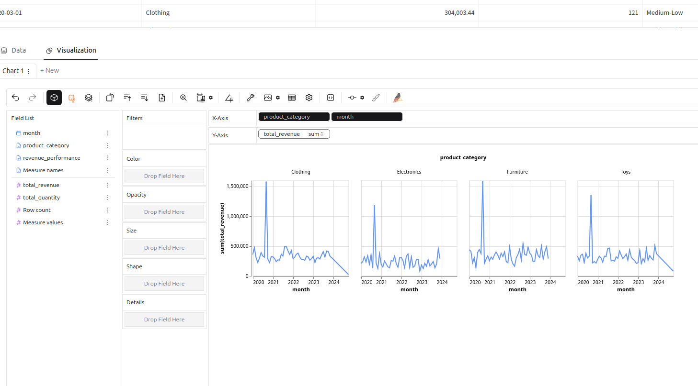

# Sales data etl

## Sales oltp database with simulated data (Poisson law) transformed into monthly sales report
this project aggregates data from an oltp database the data is simulated using Poisson law  
the data input are sales transaction and product metadata  
the output is a monthly report sales  
a streamlit app with pygwalk library is used to analyze the sales  

