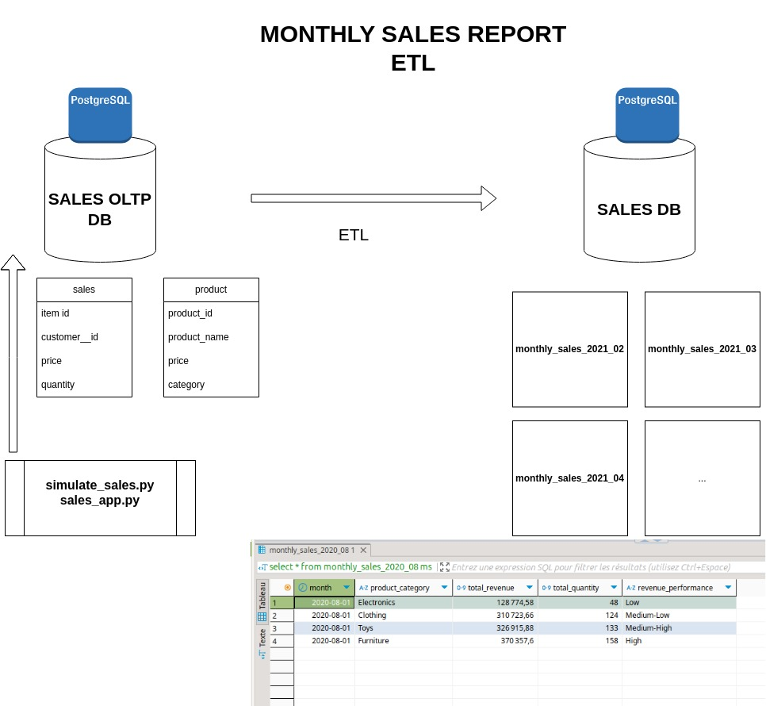

# Sales data etl

Sales oltp database with simulated data (Poisson law) transformed into monthly sales report

.
├── catalog_db
│   ├── avg_screen_size.py
│   ├── count_documents.py
│   ├── data
│   ├── export_to_csv.py
│   └── insert_documents.py
├── data
│   ├── electronics.csv
│   └── oltpdata.csv
├── etl
│   ├── config
│   ├── logs
│   ├── src
│   └── tests
├── ETL.jpg
├── notebooks
│   └── sales_simulation.ipynb
├── README.md
├── requirements.txt
├── sales_app
│   ├── data
│   ├── ingest_csv_to_postgres _all.py
│   ├── ingest_csv_to_postgres.py
│   ├── insert_fake_metadata.py
│   ├── logs
│   ├── sales_append.sh
│   ├── sales_app.py
│   └── simulate_sales.py
└── scripts
    ├── datadump.sh
    └── sales_data.sql
